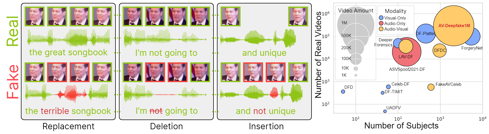

# AV-Deepfake1M

<div align="center">
    
    <p></p>
</div>

<div align="center">
    <a href="https://github.com/ControlNet/AV-Deepfake1M/issues">
        
    </a>
    <a href="https://github.com/ControlNet/AV-Deepfake1M/network/members">
        
    </a>
    <a href="https://github.com/ControlNet/AV-Deepfake1M/stargazers">
        
    </a>
    <a href="https://pypi.org/project/avdeepfake1m/"></a>
    <a href="https://pypi.org/project/avdeepfake1m/"></a>
    <a href="https://github.com/ControlNet/AV-Deepfake1M/blob/master/LICENSE">
        
    </a>
    <a href="https://arxiv.org/abs/2311.15308">
        
    </a>
</div>

This is the official repository for the paper 
[AV-Deepfake1M: A Large-Scale LLM-Driven Audio-Visual Deepfake Dataset](https://dl.acm.org/doi/abs/10.1145/3664647.3680795) (Best Award).

## News

- [2025/04/08] 🏆 [**2025 1M-Deepfakes Challenge**](https://deepfakes1m.github.io/2025) starts. New database (2M videos!) - **AV-Deepfake1M++** is released
- [2024/10/13] 🚀 [**PYPI package**](https://pypi.org/project/avdeepfake1m/) is released.
- [2024/07/15] 🔥 [**AV-Deepfake1M** paper](https://dl.acm.org/doi/abs/10.1145/3664647.3680795) is accepted in MM 2024.
- [2024/03/09] 🏆 [**2024 1M-Deepfakes Challenge**](https://deepfakes1m.github.io/2024) starts.

## Abstract
The detection and localization of highly realistic deepfake audio-visual content are challenging even for the most 
advanced state-of-the-art methods. While most of the research efforts in this domain are focused on detecting 
high-quality deepfake images and videos, only a few works address the problem of the localization of small segments of 
audio-visual manipulations embedded in real videos. In this research, we emulate the process of such content generation 
and propose the AV-Deepfake1M dataset. The dataset contains content-driven (i) video manipulations, 
(ii) audio manipulations, and (iii) audio-visual manipulations for more than 2K subjects resulting in a total of more 
than 1M videos. The paper provides a thorough description of the proposed data generation pipeline accompanied by a 
rigorous analysis of the quality of the generated data. The comprehensive benchmark of the proposed dataset utilizing 
state-of-the-art deepfake detection and localization methods indicates a significant drop in performance compared to 
previous datasets. The proposed dataset will play a vital role in building the next-generation deepfake localization 
methods.

https://github.com/user-attachments/assets/d91aee8a-0fb5-4dff-ba20-86420332fed5


## Dataset

### Download

We're hosting [1M-Deepfakes Detection Challenge](https://deepfakes1m.github.io/2024) at ACM MM 2024.

### Baseline Benchmark

| Method                     | AP@0.5 | AP@0.75 | AP@0.9 | AP@0.95 | AR@50 | AR@20 | AR@10 | AR@5  |
|----------------------------|--------|---------|--------|---------|-------|-------|-------|-------|
| PyAnnote                   | 00.03  | 00.00   | 00.00  | 00.00   | 00.67 | 00.67 | 00.67 | 00.67 |
| Meso4                      | 09.86  | 06.05   | 02.22  | 00.59   | 38.92 | 38.81 | 36.47 | 26.91 |
| MesoInception4             | 08.50  | 05.16   | 01.89  | 00.50   | 39.27 | 39.00 | 35.78 | 24.59 |
| EfficientViT               | 14.71  | 02.42   | 00.13  | 00.01   | 27.04 | 26.43 | 23.90 | 20.31 |
| TriDet + VideoMAEv2        | 21.67  | 05.83   | 00.54  | 00.06   | 20.27 | 20.12 | 19.50 | 18.18 |
| TriDet + InternVideo       | 29.66  | 09.02   | 00.79  | 00.09   | 24.08 | 23.96 | 23.50 | 22.55 |
| ActionFormer + VideoMAEv2  | 20.24  | 05.73   | 00.57  | 00.07   | 19.97 | 19.81 | 19.11 | 17.80 |
| ActionFormer + InternVideo | 36.08  | 12.01   | 01.23  | 00.16   | 27.11 | 27.00 | 26.60 | 25.80 |
| BA-TFD                     | 37.37  | 06.34   | 00.19  | 00.02   | 45.55 | 35.95 | 30.66 | 26.82 |
| BA-TFD+                    | 44.42  | 13.64   | 00.48  | 00.03   | 48.86 | 40.37 | 34.67 | 29.88 |
| UMMAFormer                 | 51.64  | 28.07   | 07.65  | 01.58   | 44.07 | 43.45 | 42.09 | 40.27 |


### Metadata Structure

The metadata is a json file for each subset (train, val), which is a list of dictionaries. The fields in the dictionary are as follows.
- file: the path to the video file.
- original: if the current video is fake, the path to the original video; otherwise, the original path in VoxCeleb2.
- split: the name of the current subset.
- modify_type: the type of modifications in different modalities, which can be ["real", "visual_modified", "audio_modified", "both_modified"]. We evaluate the deepfake detection performance based on this field.
- audio_model: the audio generation model used for generating this video.
- fake_segments: the timestamps of the fake segments. We evaluate the temporal localization performance based on this field.
- audio_fake_segments: the timestamps of the fake segments in audio modality.
- visual_fake_segments: the timestamps of the fake segments in visual modality.
- video_frames: the number of frames in the video.
- audio_frames: the number of frames in the audio.

## SDK

We provide a Python library `avdeepfake1m` to load the dataset and evaluation.

### Installation

```bash
pip install avdeepfake1m
```

### Usage

Prepare the dataset as follows.

```
|- train_metadata.json
|- train_metadata
|  |- ...
|- train
|  |- ...
|- val_metadata.json
|- val_metadata
|  |- ...
|- val
|  |- ...
|- test_files.txt
|- test
```

Load the dataset.

```python
from avdeepfake1m.loader import AVDeepfake1mDataModule

# access to Lightning DataModule
dm = AVDeepfake1mDataModule("/path/to/dataset")
```

Evaluate the predictions. Firstly prepare the predictions as described in the [details](https://deepfakes1m.github.io/2024/details). Then run the following code.

```python
from avdeepfake1m.evaluation import ap_ar_1d, auc
print(ap_ar_1d("<PREDICTION_JSON>", "<METADATA_JSON>", "file", "fake_segments", 1, [0.5, 0.75, 0.9, 0.95], [50, 30, 20, 10, 5], [0.5, 0.55, 0.6, 0.65, 0.7, 0.75, 0.8, 0.85, 0.9, 0.95]))
print(auc("<PREDICTION_TXT>", "<METADATA_JSON>", "file", "fake_segments"))
```

## License

The dataset is under the [EULA](eula.pdf). You need to agree and sign the EULA to access the dataset.

The other parts of this project is under the CC BY-NC 4.0 license. See [LICENSE](LICENSE) for details.

## References

If you find this work useful in your research, please cite it.

```bibtex
@inproceedings{cai2024av,
  title={AV-Deepfake1M: A large-scale LLM-driven audio-visual deepfake dataset},
  author={Cai, Zhixi and Ghosh, Shreya and Adatia, Aman Pankaj and Hayat, Munawar and Dhall, Abhinav and Gedeon, Tom and Stefanov, Kalin},
  booktitle={Proceedings of the 32nd ACM International Conference on Multimedia},
  pages={7414--7423},
  year={2024},
  doi={10.1145/3664647.3680795}
}
```

The challenge summary paper:
```bibtex
@inproceedings{cai20241m,
  title={1M-Deepfakes Detection Challenge},
  author={Cai, Zhixi and Dhall, Abhinav and Ghosh, Shreya and Hayat, Munawar and Kollias, Dimitrios and Stefanov, Kalin and Tariq, Usman},
  booktitle={Proceedings of the 32nd ACM International Conference on Multimedia},
  pages={11355--11359},
  year={2024},
  doi={10.1145/3664647.3689145}
}
```
